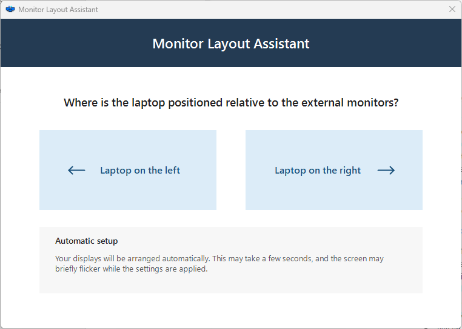
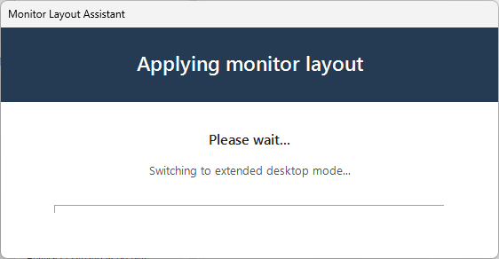
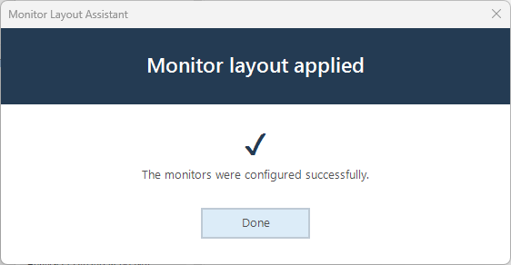
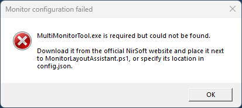

# Monitor Layout Assistant

Monitor Layout Assistant is a small Windows utility that arranges a laptop display and connected external monitors. The user only selects whether the laptop is physically positioned to the left or right of the external monitors.

The application then:

- switches Windows to extended desktop mode;
- applies the maximum available resolution to each display;
- positions all displays horizontally;
- selects an external monitor as the primary display.

The interface and configuration are intentionally simple. Monitor Layout Assistant is intended for standardized desks where external monitors are connected in a consistent order.

## Screenshots

### Select the laptop position



### Apply and complete the layout

| Applying the layout | Layout completed |
|---|---|
|  |  |

An additional progress state is available in [`Screenshots/arranging-monitors.png`](Screenshots/arranging-monitors.png).

### Missing required dependency



## Supported layout

The primary supported configuration is:

- one active built-in laptop display;
- one or two external monitors;
- all monitors positioned in one horizontal row;
- the laptop positioned completely to the left or right of the external monitors.

The script can process more than two external monitors, but those configurations have not yet been designated as the primary tested scenario. Vertical layouts, stacked displays and a laptop positioned between external monitors are not supported.

## Physical monitor order

> [!IMPORTANT]
> Monitor Layout Assistant cannot determine where a monitor is physically located. External monitors are arranged according to the display order reported by Windows.

When using a docking station, connect the external monitors so that the order reported by Windows matches their physical left-to-right arrangement. A connector labelled `Display 1` or `Port 1` on a dock is not guaranteed to become `DISPLAY1` in Windows. Enumeration can vary by dock, graphics driver, firmware and connection method.

Validate the monitor order with **Settings > System > Display > Identify** before deploying the tool broadly on a particular hardware combination.

## Primary display selection

Monitor Layout Assistant always selects an external monitor as the primary display:

| Number of external monitors | Primary display |
|---:|---|
| 1 | The external monitor |
| 2 | The left external monitor |
| 3 | The center external monitor |
| 4 | The second external monitor from the left |

With an odd number of external monitors, the center external monitor becomes primary. With an even number, the left monitor of the two center displays becomes primary. The built-in laptop display is never selected as primary.

This selection uses the display order reported by Windows, not the labels printed on docking station ports.

## Requirements

- Windows 10 or Windows 11
- Windows PowerShell 5.1
- An interactive user session
- At least one external monitor
- [MultiMonitorTool](https://www.nirsoft.net/utils/multi_monitor_tool.html)

### MultiMonitorTool

`MultiMonitorTool.exe` is mandatory and is not included in this repository. Download it from the official NirSoft website and assess it according to your organization's security requirements.

By default, Monitor Layout Assistant looks for `MultiMonitorTool.exe` in the same directory as `MonitorLayoutAssistant.ps1`. A different location can be configured in `config.json`:

```json
{
  "multiMonitorToolPath": "C:\\Tools\\NirSoft\\MultiMonitorTool.exe"
}
```

Environment variables are supported, for example:

```json
{
  "multiMonitorToolPath": "%ProgramFiles%\\NirSoft\\MultiMonitorTool.exe"
}
```

The `-MultiMonitorToolPath` script parameter can also override the configured location for a single invocation.

## Languages

The interface language is configured in `config.json`. English is used by default and as the fallback when the configured language file does not exist or cannot be read.

Included languages:

| Locale | Language |
|---|---|
| `en-US` | English |
| `nl-NL` | Dutch |
| `de-DE` | German |
| `fr-FR` | French |
| `es-ES` | Spanish |
| `it-IT` | Italian |
| `pt-PT` | Portuguese |

Each translation is stored as a separate JSON file in the `Languages` folder, for example `Languages/en-US.json` and `Languages/nl-NL.json`. This keeps translations easy to review and extend without changing the PowerShell script.

Set the language in `config.json`:

```json
{
  "multiMonitorToolPath": "",
  "language": "nl-NL"
}
```

Language selection is not derived from the Windows display language. Change the `language` value in `config.json` whenever another included translation should be used.

## Interface colors

Interface colors can be changed without editing the PowerShell script. Add or modify the `theme` section in `config.json` using six-digit hexadecimal colors:

```json
{
  "multiMonitorToolPath": "",
  "language": "en-US",
  "theme": {
    "primary": "#243B53",
    "window": "#FFFFFF",
    "headerText": "#FFFFFF",
    "text": {
      "primary": "#202020",
      "secondary": "#525252"
    },
    "choice": {
      "background": "#DCECF8",
      "foreground": "#174F7A",
      "hover": "#C9E1F3",
      "pressed": "#B5D5EC",
      "border": "#DCECF8",
      "borderSize": 0,
      "arrowSize": 26
    },
    "information": {
      "background": "#F7F7F7",
      "border": "#D8DEE5",
      "borderSize": 0
    },
    "controls": {
      "border": "#BECAD5"
    }
  }
}
```

The `choice.borderSize` value accepts a whole number from `0` through `5`; the default `0` creates borderless choice buttons. `choice.arrowSize` controls the arrow length and accepts `16` through `40`. The information panel has square corners and supports an optional border of `0` through `5` pixels; `0` disables the border. The installer writes this complete configuration to the installed `config.json` and replaces an existing configuration when run again. Individual settings may be omitted to retain their built-in defaults. Missing or invalid values do not prevent the application from starting; they are ignored and recorded as warnings in the application log. See `config.example.json` for a complete example.

## Installation

### Standard installation

1. Download this repository or its release archive.
2. Download MultiMonitorTool from [NirSoft](https://www.nirsoft.net/utils/multi_monitor_tool.html).
3. Place `MultiMonitorTool.exe` next to `Install.ps1`.
4. Run Windows PowerShell as administrator.
5. Run:

```powershell
Set-ExecutionPolicy -Scope Process Bypass
.\Install.ps1
```

The installer copies the application, language files, icon assets and MultiMonitorTool to:

```text
C:\Program Files\Monitor Layout Assistant
```

It also creates a Start menu shortcut for all users.

The running application sets its own Windows taskbar identity and window icon. This allows Windows to display the Monitor Layout Assistant icon instead of identifying the window as the generic PowerShell host.

### Use an existing MultiMonitorTool location

To reference an existing copy without placing it in the application directory:

```powershell
.\Install.ps1 -MultiMonitorToolPath "C:\Tools\NirSoft\MultiMonitorTool.exe"
```

The installer validates the path and writes it to `config.json`. It does not copy or modify the external executable.

## Optional hidden PowerShell host

Windows PowerShell normally displays a console window while the graphical application is running. This does not affect functionality.

Administrators who want to suppress the console can assess and install [SeidChr/RunHiddenConsole](https://github.com/SeidChr/RunHiddenConsole) as `powershellw.exe`. The recommended location is next to Windows PowerShell:

```text
%SystemRoot%\System32\WindowsPowerShell\v1.0\powershellw.exe
```

That directory is normally part of the system `PATH`. During installation, Monitor Layout Assistant checks this exact location. If `powershellw.exe` exists, the Start menu shortcut uses it. Otherwise, the shortcut uses the native `powershell.exe` and the console remains visible.

The PowerShell host is stored in the shortcut when the installer runs; it is not detected again when the application starts. If `powershellw.exe` is copied to the recommended location after Monitor Layout Assistant has already been installed, the existing shortcut will continue to use `powershell.exe`. Run `Install.ps1` again to recreate the shortcut, or manually change its **Target** from `powershell.exe` to:

```text
%SystemRoot%\System32\WindowsPowerShell\v1.0\powershellw.exe
```

RunHiddenConsole is optional, is not included, and must be assessed separately before use.

## Manual use

Monitor Layout Assistant can also be run without installation:

```powershell
.\MonitorLayoutAssistant.ps1
```

Place `MultiMonitorTool.exe` in the same directory or provide its location:

```powershell
.\MonitorLayoutAssistant.ps1 `
    -MultiMonitorToolPath "C:\Tools\NirSoft\MultiMonitorTool.exe"
```

Keep the `Languages` folder in the same directory as `MonitorLayoutAssistant.ps1`.

## Logging

Monitor Layout Assistant writes a persistent per-user log file, including when the application is started with the optional hidden PowerShell host:

```text
%LocalAppData%\Monitor Layout Assistant\Logs\MonitorLayoutAssistant.log
```

Every entry uses the same timestamp and severity format:

```text
2026-08-31 09:42:13.125 [INFO] Application started. Version=0.1.0 Computer=PC01 User=user ProcessId=1234
2026-08-31 09:42:14.020 [INFO] Displays detected. Total=3 External=2 BuiltIn=1
2026-08-31 09:42:20.417 [INFO] Configuration completed successfully.
2026-08-31 09:43:02.006 [ERROR] Configuration failed. Message=...
```

The log records:

- application version, computer, user and process ID;
- selected language and MultiMonitorTool path;
- detected monitor count, order, names and resolutions;
- selected laptop position and primary display;
- configuration actions, cancellations, warnings and errors.

Line breaks in error details are normalized so every event remains on one log line. When the log reaches 2 MB, the previous file is retained as `MonitorLayoutAssistant.log.1`. If the log directory cannot be created or written, the application continues with console-only logging.

The log contains the Windows computer name, user name and connected monitor identification. Review this information against your organization's privacy and support requirements before deployment.

## Uninstallation

Run Windows PowerShell as administrator from a separate directory and execute:

```powershell
.\Uninstall.ps1
```

The uninstaller removes the application directory and Start menu shortcut. It never removes MultiMonitorTool from a separately configured external location and does not remove `powershellw.exe`.

## Detection assumptions and limitations

MultiMonitorTool obtains monitor names from EDID data. The current detection logic treats a display without a `Monitor Name` value as the built-in laptop display and a display with a value as external. This works with the hardware for which the tool was created, but some panels, docks, adapters or KVM switches may expose different information.

Other limitations:

- Display order is based on Windows `DISPLAYx` numbering, not physical position or dock port labels.
- Maximum resolution is applied; scaling and refresh rate are not explicitly configured.
- Existing display settings are not saved or restored.
- The application minimizes open windows before showing the layout selection.
- Only the first display detected as the built-in laptop panel is used.

Test the application with each intended laptop, dock, graphics driver and monitor combination before production deployment.

## Third-party software

No third-party binaries are distributed with this project. See [THIRD-PARTY-NOTICES.md](THIRD-PARTY-NOTICES.md) for details.

## License

Monitor Layout Assistant is available under the [MIT License](LICENSE). Third-party software remains subject to its own license and distribution terms.